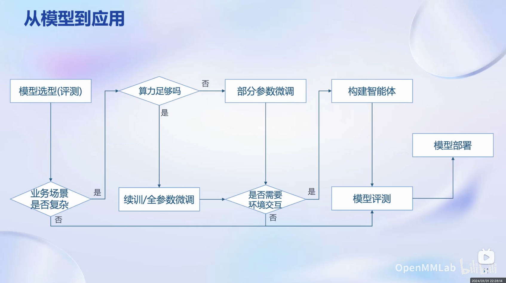
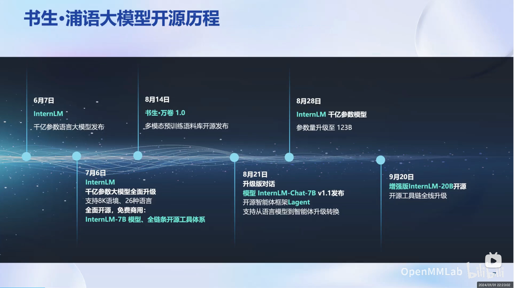
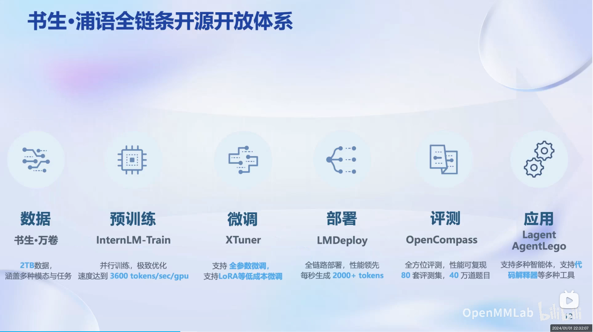
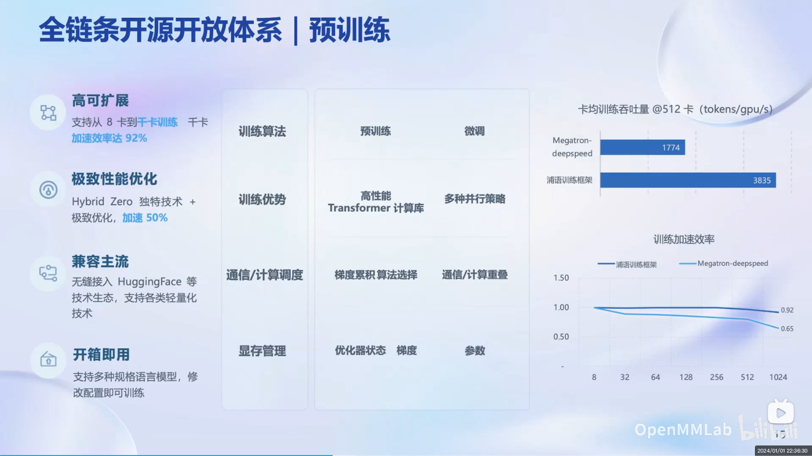
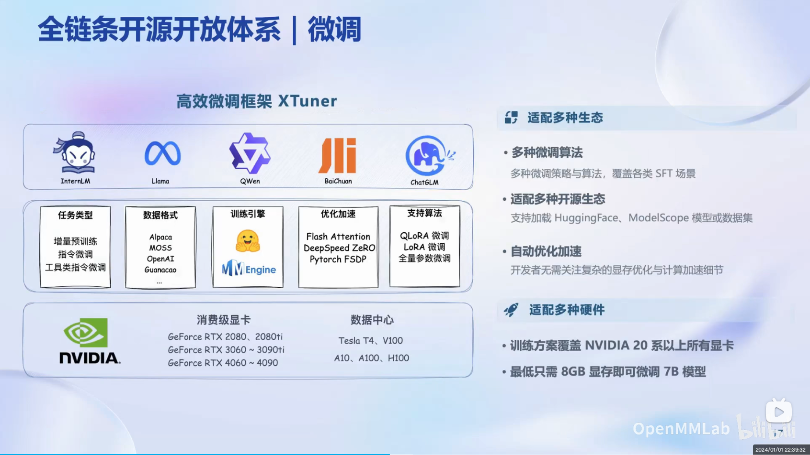
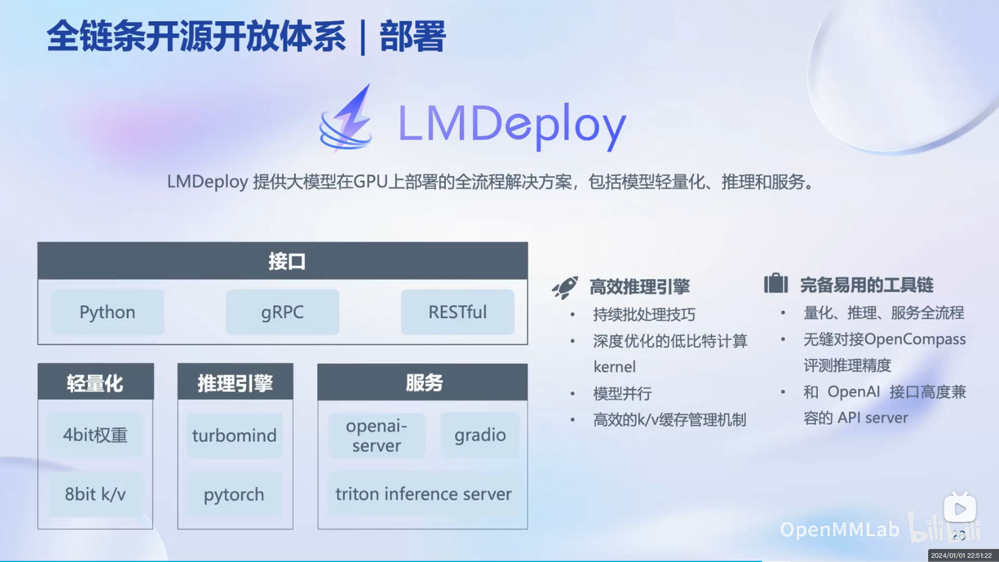
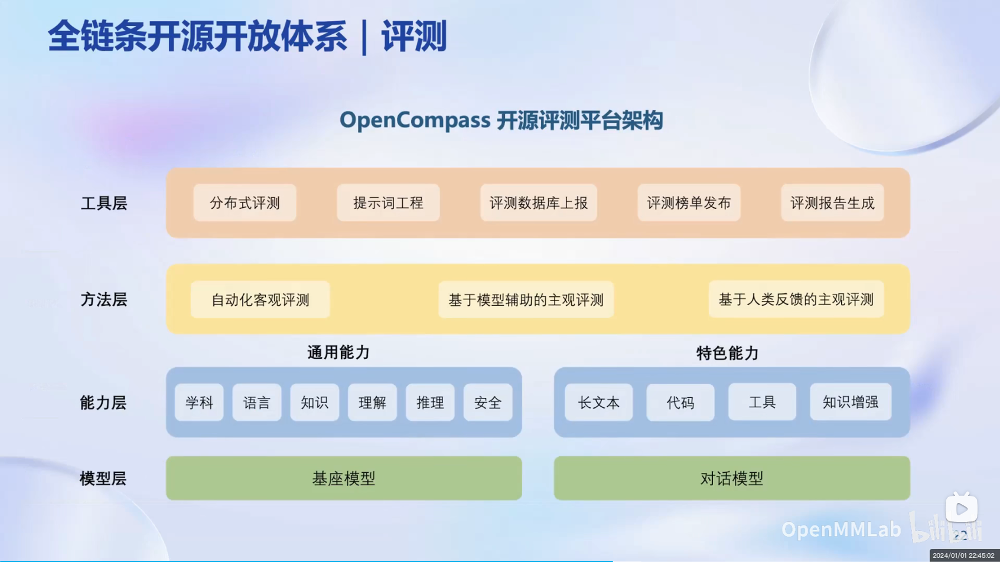

# 第 1 节 书生·浦语大模型全链路开源体系

本课主要是一些大模型基础知识和书生体系基本情况的介绍, 主要包括: 

1. 大模型发展历史和现状
2. 大模型开发流程和步骤
3. 书生浦语大模型开源历程
4. 书生浦语大模型全链条开源开放体系

# 大模型发展历史和现状

大模型进入人们的视野大概是从2018年开始, 随后经过几年的发展, 于2023年由OpenAI的ChatGPT彻底引爆, 进入高速发展阶段, 大模型开始应用到各个领域。

# 大模型开发流程和步骤

# 书生浦语大模型开源历程

# 书生浦语大模型全链路体系

1. 数据（书生万卷）
2. 预训练（Intern-Train）
3. 微调（XTuner）
4. 部署（LMDeploy）
5. 评测（OpenCompass）
6. 应用（Lagent AgentLego）

## 数据（书生万卷）

书生万卷 V1.0发布于2023年8月14日, 总数据量达到2TB, 涵盖文本、图像和视频, 并经过了多模态融合、精细化处理和价值观对齐, 是不可多得的优质训练材料。

## 预训练（Intern-Train）

具有高可扩展、极致性能优化、兼容主流、开箱急用等优点。

## 微调（XTuner）

大预言模型的下游应用中, 经常用到的两种方式是增量续训和有监督微调。

增量续训

使用场景: 让基座模型学习到一些新知识
训练数据: 文章书籍代码等

有监督微调

使用场景: 让模型学会理解和遵循各种指令, 或者注入少量领域知识
训练数据: 高质量的对话、问答数据

高效微调框架 XTuner 除了支持多种微调算法外, 适配了多种开源生态和硬件, 并能做到自动优化加速, 对显存做了极致优化使得消费级显卡(8G)即可玩转微调。

## 部署（LMDeploy）

LMDeploy提供大模型在GPU上部署的全流程解决方案, 包括模型轻量化、推理和服务。

## 评测（OpenCompass）

OpenCompass是全球领先的大模型开源评测体系, 涵盖6大维度, 80+评测集和40万+评测题目。

## 应用（Lagent 和 AgentLego）

Lagent 是一个轻量级、开源的基于大语言模型的智能体（agent）框架，支持用户快速地将一个大语言模型转变为多种类型的智能体，并提供了一些典型工具为大语言模型赋能。

AgentLego 是一个多模态智能体工具箱, 提供了丰富的工具集合, 支持多个主流智能体系统, 提供了灵活的多模态工具调用接口以及一键式远程工具部署等功能。

