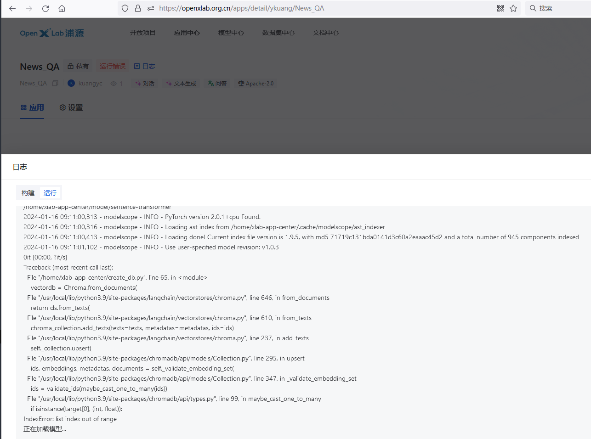

# 第三课笔记 基于 InternLM 和 Langchain 搭建你的知识库


# Langchain

我们都知道，LLM模型本身是不支持多轮对话的，比如ChatGPT，他是在GPT的基础上额外加了Memory，才得以实现多轮对话的能力；

那么，除此之外，我们还能叠加什么能力呢：

1）代码执行能力：计算复杂数学问题；
2）搜索引擎能力：提高模型回答内容的时效性；
3）数据库检索能力：实现自定义数据的分析、总结；

这就需要用到LangChain这个框架；

LangChain是一个能够让LLMs快速的落地的部署框架，相当于给你的LLM套上了一层盔甲，构建属于你自己的AI产品；


本次课程用到了LangChain的代码执行能力和数据库检索能力。


具体的课程操作步骤在https://github.com/InternLM/tutorial/blob/main/langchain/readme.md已经有非常详细的说明, 笔记就不再重复粘贴了, 主要把操作过程中遇到过的问题记录一下：


# 问题解决


## 问题1


```
huggingface_hub.utils._validators.HFValidationError: Repo id must be in the form 'repo_name' or 'namespace/repo_name': '/root/data/model/Shanghai_AI_Laboratory/internlm-chat-7b'. Use `repo_type` argument if needed
```

这个错一般是模型的路径改漏了或者写错了


## 问题2

这个是在OpenXLab上部署应用的时候, 数据集的路径不正确, 找不到可以训练的数据导致:



openxlab上的运行的应用会把代码仓库下载到当前路径, 数据集所在路径是`/home/xlab-app-center`+代码仓库的路径：

```
# 目标文件夹
tar_dir = [
    "/home/xlab-app-center/data"
]
```


## 问题3


### 在openxlab上运行`python app.py`报`Killed`

查看系统日志`egrep -i 'killed process' /var/log/syslog`, 如果有 Out of memory 字样, 就是内存不足了。


## 问题4

选用新闻内容作为垂直领域似乎不是一个好的选择, 问问题, 基本无法按照预期返回结果, 需要进一步研究下知识库知识如何整理和训练。

