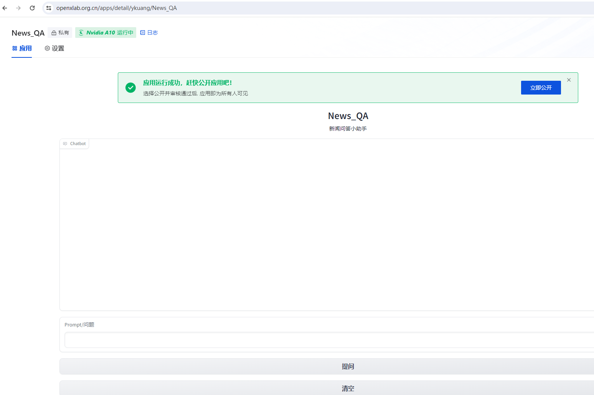

# 第三课作业 基于 InternLM 和 Langchain 搭建你的知识库

**作业**

提交方式：在各个班级对应的 GitHub Discussion 帖子中进行提交。

**基础作业：**

复现课程知识库助手搭建过程 (截图)

**进阶作业：**

选择一个垂直领域，收集该领域的专业资料构建专业知识库，并搭建专业问答助手，并在 OpenXLab 上成功部署（截图，并提供应用地址）

## 基础作业

### 复现课程知识库助手搭建过程 (截图)

按照教程步骤一步步操作, 最后 浏览器打开http://127.0.0.1:7860：

# 进阶作业

## 在 OpenXLab 上成功部署垂直领域知识库

操作步骤详见github项目说明: https://github.com/ykuang/News_QA/

浏览器打开: openxlab.org.cn/apps/detail/ykuang/News_QA

操作过程中遇到的问题记录在[课程笔记](lesson3.md)中。