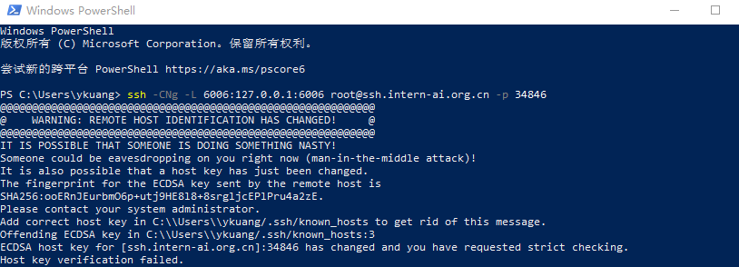
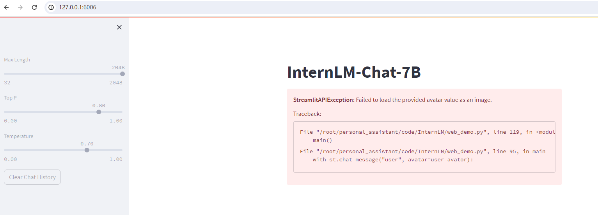

# 第四课 XTuner 大模型单卡低成本微调实战

XTuner是一个大语言模型微调工具箱。由 MMRazor 和 MMDeploy 联合开发。

它的特色是:

- 🤓 **傻瓜化：** 以 配置文件 的形式封装了大部分微调场景，**0基础的非专业人员也能一键开始微调**。
- 🍃 **轻量级：** 对于 7B 参数量的LLM，**微调所需的最小显存仅为 8GB** ： **消费级显卡✅，colab✅**

本课主要内容是使用XTuner对现有模型进行微调, 并验证微调成果, 详见"[第四课作业](lesson4_homework.md)"。

此笔记主要记录下操作过程中遇到的一些问题和解决办法：

1. 开发机无法连接

   

   原因是长时间关机后再次启动, 资源已经被回收, 导致连不上, 删掉本地`~/.ssh/known_hosts`文件里的开发机条目再重新连就可以了

2. 行命令的当前目录不对

   

   原因是执行命令的当前目录不对, 导致用户图偶像图片文件无法访问而报错

3. 训练不成功, 模型还是没有认识到它是我的小助手
   
   原因是训练数据太少或者训练轮数不够, 多喂给它几次它就懂了

