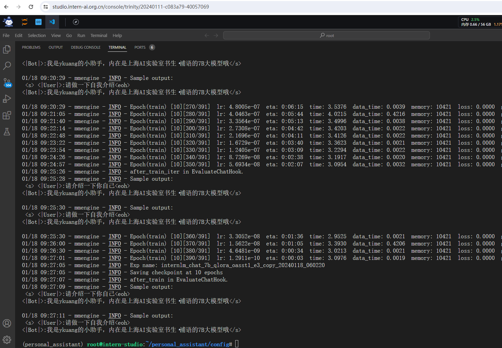

# 第四课作业 XTuner 大模型单卡低成本微调实战

基础作业：

构建数据集，使用 XTuner 微调 InternLM-Chat-7B 模型, 让模型学习到它是你的智能小助手，效果如下图所示，本作业训练出来的模型的输出需要将不要葱姜蒜大佬替换成自己名字或昵称！
作业参考答案：https://github.com/InternLM/tutorial/blob/main/xtuner/self.md

## 构建数据集，使用 XTuner 微调 InternLM-Chat-7B 模型, 让模型学习到它是你的智能小助手

开始训练:

若干轮后:

最终训练成功, 让模型学习到它是我的智能小助手: 

