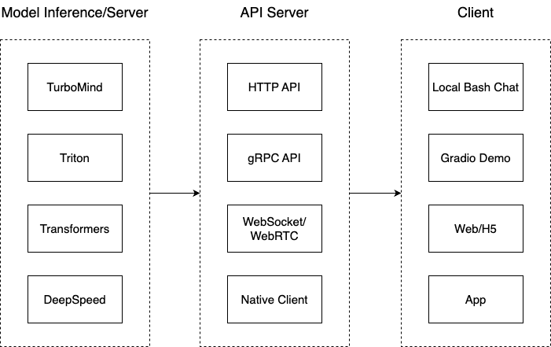

# 第五课 LMDeploy 大模型量化部署实践

LMDeploy 由 [MMDeploy](https://github.com/open-mmlab/mmdeploy) 和 [MMRazor](https://github.com/open-mmlab/mmrazor) 团队联合开发，是涵盖了 LLM 任务的全套轻量化、部署和服务解决方案。 这个强大的工具箱提供以下核心功能：

- **高效的推理**：LMDeploy 开发了 Persistent Batch(即 Continuous Batch)，Blocked K/V Cache，动态拆分和融合，张量并行，高效的计算 kernel等重要特性。推理性能是 vLLM 的 1.8 倍
- **可靠的量化**：LMDeploy 支持权重量化和 k/v 量化。4bit 模型推理效率是 FP16 下的 2.4 倍。量化模型的可靠性已通过 OpenCompass 评测得到充分验证。
- **便捷的服务**：通过请求分发服务，LMDeploy 支持多模型在多机、多卡上的推理服务。
- **有状态推理**：通过缓存多轮对话过程中 attention 的 k/v，记住对话历史，从而避免重复处理历史会话。显著提升长文本多轮对话场景中的效率。

LMDeploy 从架构上把整个服务流程分成下面几个模块。

- 模型推理/服务。主要提供模型本身的推理，一般来说可以和具体业务解耦，专注模型推理本身性能的优化。可以以模块、API等多种方式提供。
- Client。可以理解为前端，与用户交互的地方。
- API Server。一般作为前端的后端，提供与产品和服务相关的数据和功能支持。

本课主要内容是使用LMDeploy 对现有模型进行部署。

这次比较顺利, 在操作过程中没有遇到问题。

