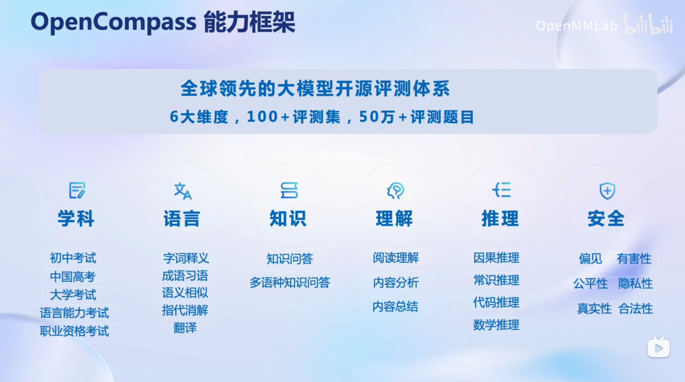
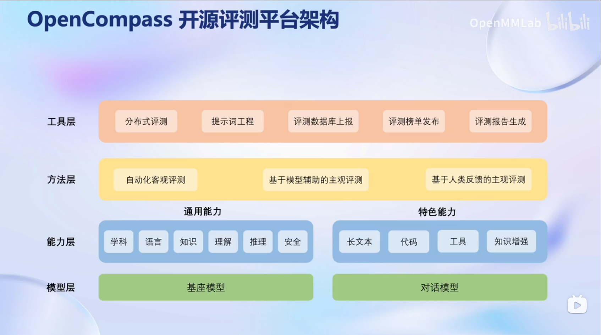
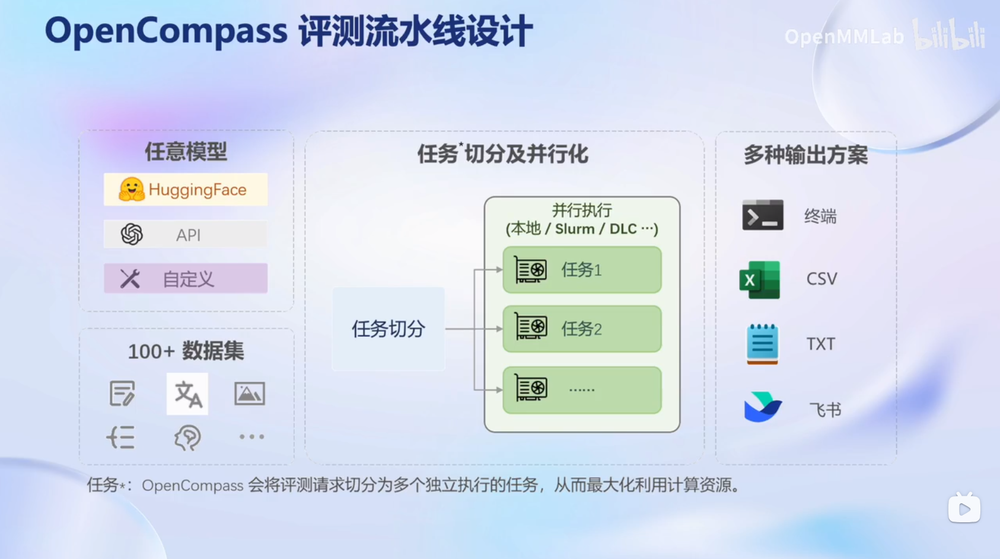

# 第六课 OpenCompass 大模型评测解读及实战指南

OpenCompass 是面向大模型评测的一站式平台。其主要特点如下：

- **开源可复现**：提供公平、公开、可复现的大模型评测方案
- **全面的能力维度**：五大维度设计，提供 70+ 个数据集约 40 万题的的模型评测方案，全面评估模型能力
- **丰富的模型支持**：已支持 20+ HuggingFace 及 API 模型
- **分布式高效评测**：一行命令实现任务分割和分布式评测，数小时即可完成千亿模型全量评测
- **多样化评测范式**：支持零样本、小样本及思维链评测，结合标准型或对话型提示词模板，轻松激发各种模型最大性能
- **灵活化拓展**：想增加新模型或数据集？想要自定义更高级的任务分割策略，甚至接入新的集群管理系统？OpenCompass 的一切均可轻松扩展！

OpenCompass包含6大维度, 100+评测集和50万+评测题目, 是全球领先的大模型开源评测体系。

OpenCompass的架构由工具层、方法层、能力层和模型层组成。

OpenCompass的评测流水线设计会将评测请求切分为多个独立执行的任务, 从而最大化利用计算资源。

